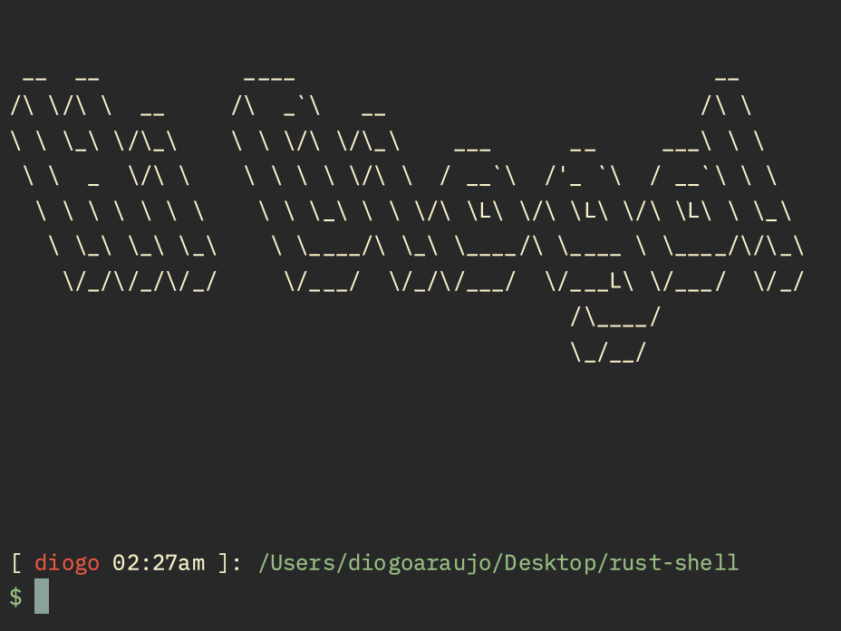

# rust-shell

This is a small project I made to deepen my understanding of Rust and Shells.

## Features

- Custom input reading, history and cursor movement.
- Piped Commands.
- Aesthetic Outputs.

## Commands

These are the commands I have implemented

`ls` `cd` `clear` `echo` `cat` `pwd` `head` `wc` `mkdir` `grep` `du` `cp`

`hashkitten` (Custom SHA-256 Implementation)

## Deployment

To deploy this project run

```bash
  cargo run
```

## Demo

